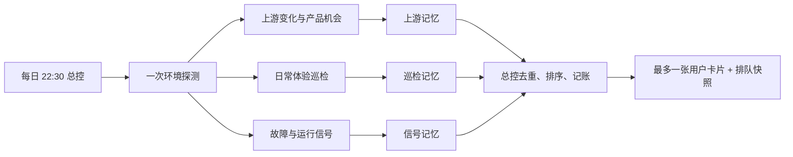

# CCEM 每日检查与推进：产品提案产出优化 Handoff

日期：2026-08-07  
状态：可交接  
目标对象：负责优化 CCEM 自动化、产品发现和证据编排的人  
当前生产任务：`ccem-ops-control-tower`（每日 22:30，唯一用户入口）

## 一句话结论

现在的自动化不是完全失效：它在 8 月 3 日找到了一个有效方向，并在用户回复“深入”后把它补成了有边界的执行建议。真正的问题是，拆分后“发现线索”和“向用户提案”仍共用近似的严格门槛，很多值得继续验证的线索在进入候选池前就被丢掉；另外两条收集线又长期受锁屏、旧安装版、无调试桥、无测试夹具和隐私边界限制，所以用户最终经常只看到“无需处理”。

这次优化的目标不是恢复“每天硬凑几个功能点”，而是提高有价值方向的召回率，同时保持去重、只读、单一入口和明确授权边界。

## 接手人需要完成什么

请优化发现漏斗、扫描节奏和内部证据结构，使这套任务做到：

1. 每日继续检查故障、交付状态和便宜的上游版本变化。
2. 产品发现不再只依赖当天版本变更，而是按周合成一段时间内的上游需求、CCEM 现状和重复摩擦。
3. 值得继续调查、但尚不足以向用户正式提案的线索可以留在内部滚动候选池，不会因游标推进而消失。
4. 一旦候选满足产品方向门槛，最迟在下一个允许展示的时段交给用户，不受执行位已满影响。
5. 用户侧仍只有一个任务、每轮最多一张完整卡片，不自动实现、不重复提醒、不把技术新闻直接翻译成功能待办。

## 当前链路



三个收集器只写各自记忆；总控读取三份记忆和账本后，成为唯一用户出口。这个单入口设计应保留。

## 8 月 3 日改造后的真实结果

| 日期 | 实际发生的事 | 用户看到什么 | 说明 |
| --- | --- | --- | --- |
| 8 月 3 日 | 因新的产品机会游标不存在，完成了最近 7 天的完整机会扫描；把既有 `ccem-2026-0025` 补成“受影响的 Codex 用户在旧模型停用前看到准确迁移提示” | 1 张产品方向卡 | 新链路能够发现并展示方向，不是完全失效 |
| 8 月 4 日上午 | 用户回复“深入”；只读核对官方账户、配置、模型和 CCEM 启动路径，把同一 ID 补成范围明确、预计 1–2 天、有成功标准和回退方式的执行建议 | 1 张执行决策卡 | “深入”和“做”的权限分层有效 |
| 8 月 4 日晚 | 扫描 Claude Code/Agent SDK `2.1.221` / `0.3.221` 及 Issues/可用 Discussions，没有新方向 | 发布确认 + 既有队列项 | 扫描真实执行，不是因为没跑而空 |
| 8 月 5 日 | 扫描 `2.1.222` / `0.3.222`；Skills CLI 巡检稳定；发现一条定时任务再次 exit 1，但不知道用户原本期待什么结果、是否漏交付 | 无新事项 + 既有队列项 | 故障信号存在，但无法安全说明用户后果 |
| 8 月 6 日 | 扫描 `2.1.223` / `0.3.223` / Codex `0.146.1`；发现累计费用可能重复求和的代码线索和一个跨客户端配置需求，但前者当前未显示给用户，后者只有单一实践信号 | 无新事项 + 既有队列项 | 好线索被正确挡在正式提案外，但没有内部“继续观察”层承接 |

截至 8 月 6 日，账本共有 25 项：1 项占用执行/验证位但当前受阻、1 项等待用户决定、0 项仍处于产品方向阶段。唯一等待决定的是 `ccem-2026-0025`。

## 为什么旧上游雷达显得更有产出

旧任务的稳定形态是：本地代码摸底 → 官方变化 → Issues/实践信号 → CCEM 落点 → 排出若干产品机会 → 给出不建议做什么。它经常刷新“最值得看的三项”，所以几乎每次都有内容。

拆分后的新体系获得了几个重要优点：不重复卡片、不重开已拒绝事项、不把社区热度当事实、方向和实施分权、统一账本。但它也把更多证据要求前置到了“能否保留产品方向”这一关。结果是：旧体系会留下来继续观察的线索，新体系常在当天直接判为“不构成方向”。

因此不要简单恢复“每次给三条”。应恢复旧雷达的主题积累和产品化推演能力，再让新总控负责证据门槛、去重和授权。

## 已确认的主要原因

### 1. 缺少“产品假设”这一层

当前产品方向要求同时具备：新证据、当前 CCEM 落点、可用一句话说明的用户场景和可见结果、非重复项、明确的只读下一步。

这个门槛适合决定“能不能给用户看”，不适合决定“线索要不要留下”。8 月 6 日的累计费用线索就是典型例子：代码路径和异常关系已经存在，但因为当前界面没有显示这项费用，所以它既没有成为方向，也没有一个能跨天积累证据的内部状态。

### 2. 产品发现仍然追着版本游标走

当前最低扫描集主要是官方版本/文档、官方 Issues/Discussions、当天三条内部收集线和与强信号有关的当前代码。社区实践只是可选排序信号，而且每个方向必须包含机会游标之后的新证据。

这能避免旧闻翻炒，但会漏掉“单条都不够强、连续几周合起来才说明问题”的主题，也会让没有新版本、但官方 Issue 和本地缺口已经形成的方向缺少稳定入口。

### 3. 日常体验巡检长期到不了高信息路径

8 月 3–6 日的环境共同点是：控制台锁定或锁定状态不可用、`127.0.0.1:9223` 没有可用 Tauri bridge、安装版为 `2.63.0`、源码/公开版已到 `2.64.0–2.65.0`、安全会话数为 0、没有近期可用的预置夹具。

所以巡检连续改走 Sessions、Settings/Environments、Skills、Cron 的只读 CLI 路径。四天都稳定，四天都没有候选。这个选择符合当前安全合同，但它无法发现新版本 Desktop 的交互摩擦。

### 4. 故障线看到了失败，却无法说明“用户少了什么”

`ccem-2026-0023` 的定时任务 exit 1 已在 30 天内多个独立窗口复发。当前边界不读取任务身份、目标、结果、通知和交付回执，因此只能证明“进程失败过”，不能证明“哪件事没做成”。这使它无法变成一句用户能判断的建议。

### 5. 展示节制放大了“没产出”的感受，但不是首因

当前任意滚动 7 天最多展示一个新产品方向，未首次展示的第二个方向不能从排队列表泄漏，P2 执行建议也最多 7 天提醒一次。这些规则会减少用户看到的内容，但 8 月 4–6 日内部本来就是 0 个新方向，所以先改展示频率不会解决根因。

### 6. 编排提示过长是维护风险，不是这次零产出的已证实主因

活动任务的 `automation.toml` 把调度、证据门槛、账本规则、卡片文案和直接回复语义都放在同一个约 12k 字符的 prompt 中；四个 skill 合计另有 583 行，并存在规则重复。这会增加漂移和单轮认知负担，但现有回放没有证明它直接导致了 8 月 4–6 日的零方向。应在发现漏斗修好后再瘦身，或者和第一阶段一起做纯等价重构。

## 建议的目标设计

### A. 把内部候选分成两级

新增一个只存在于内部的 `hypothesis`（名称可调整）层：

- 进入条件：有一条新的可信信号、有当前 CCEM 落点、有可解释的潜在用户收益或损失、并能写出一个有边界的只读下一步。
- 不要求：已经观察到当前用户正在受影响，也不要求实施成本和回退方案已经确定。
- 生命周期：默认保留 30 天；相同主题继续合并证据；到期仍无第二信号或可验证后果则安静退休。
- 用户可见性：永远不直接出现在卡片或排队列表。

保留当前严格的 `product_direction` 层：只有场景、可见后果、建议验证的行为、预期变化、当前新证据和最小下一步都清楚时，才允许给用户看并询问“深入”。

保留更严格的 `execution_decision` 层：必须具备范围、成本与风险、成功标准、回退方式、执行路线、非目标和可用容量，才允许询问“做”。

推荐晋级路径：

```text
原始信号 -> 内部 hypothesis -> product_direction -> 用户“深入” -> execution_decision -> 用户“做”
```

### B. 增加每周一次的 30 天主题合成

产品机会扫描要与日常版本探测分开：

- 每日：只做便宜版本探测、到期的官方完整扫描、日常巡检、故障归类。
- 每周：固定做一次产品发现，读取最近 30 天内部假设池和最近 7 天新增证据，重新合并主题、检查本地落点并决定是否晋级。
- 提前触发：只有“官方变化 + 当前 CCEM 落点 + 可能形成不同用户结果”都成立时，才提前启动主题合成；单纯包版本移动不应触发完整机会推演。

每周最低来源：

1. 集成产品的官方发布、文档和类型变化。
2. 官方仓库中最近新建或实质更新的 Issues/Discussions。
3. 最近的 CCEM 巡检、故障、审核和用户明确反馈。
4. 当前 CCEM HEAD 变化和相关产品入口。
5. 有边界的社区/竞品工作流样本，只用于发现主题和排序，不用于证明事实或直接成卡。

不要做无边界社交媒体爬取。社区样本应有固定数量、固定时间窗和固定查询主题。

### C. 为每轮发现漏斗保留内部诊断数据

每次到期扫描至少在内部记录：

- 看了哪些证据面，哪些不可用；
- 产生了多少原始信号；
- 合并成多少主题；
- 哪些进入 hypothesis；
- 哪些晋级为 product direction；
- 每个被拒绝或延后的最强候选及原因；
- 下次补哪条证据。

这些数据不面向用户，也不构成提案配额。它们用于区分“确实没有方向”和“漏斗过早把线索丢了”。

### D. 给日常体验巡检一个真实可达的只读环境

优先方案是预置一个与 current main 对齐的可丢弃开发环境：常驻可定位的 dev bridge、无真实用户数据的只读示例工作区、可恢复的页面状态。定时任务只能做导航、展开、筛选、读取状态等只读手势；发送提示、改设置、创建会话、删除或恢复文件等有副作用的主流程仍必须由用户单独批准验证。

如果无法提供这个环境，至少把每周一次 UI 巡检安排到 Mac 通常解锁的时段，并明确这仍不能证明源码最新行为。连续两次因同一环境原因不可验证后，保持 deferred 记录并停止重复选择；日常继续走可证明的 CLI 路径。

这是一项独立的环境决策，不应每天提醒用户。

### E. 给故障线增加隐私安全的结果信封

先审计现有安全元数据是否能提供以下布尔/枚举信息，而不读取 prompt、正文、stdout/stderr 或消息内容：

- `expected_result_kind`
- `result_present`
- `delivery_expected`
- `delivery_present`
- 经过归类和脱敏的 `error_class`

如果现有元数据没有这些字段，不要扩大定时任务读取权限。应另开一个有边界的 CCEM 产品决策，说明需要新增哪些脱敏字段、用户能得到什么、不会保存什么，再由用户决定是否实现。

### F. 最后再收缩 prompt 和隔离失败域

让活动 automation prompt 只保留：执行顺序、只读边界、唯一用户出口、最终输出形状和直接回复授权。稳定的资格规则、字段合同、来源政策、去重和状态机放回各自 skill/reference，并用测试固定。

内部收集线可以独立失败和重试，但只能由总控向用户说话。任何拆分都不得新增第二个用户可见自动化或提醒渠道。

## 第一轮改造范围

优先做以下四项：

1. 增加 30 天内部 hypothesis 池及去重、到期规则。
2. 把产品发现改为每周主题合成，并给“版本变化提前触发”增加用户结果预筛选。
3. 加入发现漏斗的内部诊断统计和拒绝原因。
4. 建立冻结证据回放和 7 天 shadow run。

先不要在第一轮改变：

- 每 7 天最多一张新产品方向卡；
- “深入”只读、“做”才实施；
- 被拒绝事项保持静默；
- 单一用户入口；
- 自动化的只读边界；
- CCEM 源码、发布和用户数据。

UI 夹具和结果信封可以并行调研，但如果需要改 CCEM 产品代码，必须作为另外一项明确决定，不要偷偷混进本次自动化改造。

## 固定回放验收

候选方案和现有方案必须读取同一批冻结证据，不能一边在线搜索一边比较。至少覆盖以下案例：

| 案例 | 预期结果 |
| --- | --- |
| 没有独立机会游标，但最近 7 天已有证据 | 完整扫描最近 7 天，不能只写空基线 |
| `ccem-2026-0025` 的旧 Codex 模型停用证据 | 必须恢复为一个产品方向，不能直接授权实现 |
| `ccem-2026-0014` 长回复结果缺失、`ccem-2026-0016` 隐藏字符审批风险 | 新候选层不能降低已成熟问题的发现能力 |
| 新官方 Issue + 明确 CCEM 落点 + 具体后果，但无正式能力合同 | 最多形成产品方向，不能伪装成执行建议 |
| 只有新版本，CCEM 不拥有或不受该行为影响 | 0 个方向 |
| 累计费用代码线索，当前 UI 没有显示 | 留在内部 hypothesis，不形成用户卡片 |
| 单作者的跨客户端配置分享，无维护者合同或用户代价 | 只能进入主题池或排序，不能独立成卡 |
| 官方文档、Issue、巡检指向同一问题 | 只更新一个稳定 ID |
| 已拒绝事项再次出现相同措辞 | 保持静默，除非出现全新的实测 CCEM 用户影响 |
| 必需来源暂时不可用 | 继续查可达来源，游标保持不可信，下次正常运行重试 |
| 同一周出现两个合格方向 | 只显示优先级更高的一项，另一项内部保留 |
| 三个执行位都满 | 仍发现并保留产品方向，但不启动实施 |
| 回复“深入 / 做 / ok / emoji” | 分别执行只读调查 / 有界实施 / 不改状态 / 不改状态 |

## 7 天 Shadow Run

新旧方案并行读取同一份每日输入。新方案必须使用隔离的记忆和账本副本，不向用户发消息、不创建 inbox、不改生产账本、不写 CCEM 仓库。

每天保留一份对照：触发原因、证据覆盖、候选主题、合并/拒绝原因、若允许展示会显示什么、账本校验、越界写入审计和耗时。

第 7 天由不了解实现细节的人盲评。上线必须同时满足：

- 7/7 次运行完成，隔离账本 7/7 校验通过。
- 固定回放中所有“必须发现”正例都被保留。
- 新方案至少找出 1 个当前方案漏掉、且人工评为“值得深入”的方向；否则不能证明改造提高了召回率。
- 所有“不应提议”负例产生的用户卡片为 0。
- 重复稳定 ID 和重复完整卡片为 0。
- 任意滚动 7 天模拟用户输出最多一个新产品方向。
- 所有来源缺口都如实记录，并安排下一次重试。
- 自动实施、CCEM 代码修改、Git 操作、发布、外部消息均为 0。
- 单次运行不超过 60 分钟，不得因超时或截断丢失最终记录。

自然运行 7 天内允许 0 个合格方向，但不能用自然零产出掩盖漏检：固定正例回放和至少一个差异提升仍然必须通过。

## 用户可见质量门槛

任何产品方向仍需让产品负责人在 10 秒内回答：

1. 我会在哪里遇到？
2. 现在具体会发生什么不好的结果？
3. 你到底想验证或改变什么？
4. 做完后我会看到什么不同？

建议采用三档人工盲评：

- 必须发现：场景、可见后果、新证据和 CCEM 落点都明确。
- 值得深入：价值合理，但仍缺实施证据，只能作为产品方向。
- 不应提议：只有版本号、热度、技术可能性、重复措辞，或没有具体用户结果。

“有用”看正例召回和负例准确率，不看每天出了几条。

## 不可突破的边界

- 不承诺每天或每周固定数量的 proposal。
- 不把版本号、社区热度或单个 Issue 直接变成用户卡片。
- 不新增第二个用户可见自动化、任务或提醒渠道。
- 不改变“深入”和“做”的授权含义。
- 不让定时运行批准、实现、提交、推送、发布或发外部消息。
- 不读取或复制 prompt、任务正文、stdout/stderr、密钥、凭据、消息内容和私人结果。
- 不复活已拒绝事项，除非有全新的、已观察到的 CCEM 用户影响。
- 不把本地代码、合并、远端、发布、已安装和真实采用混成一个状态。
- 不借本次优化清理历史账本或 CCEM 仓库中的用户文件。

## 当前关键文件

活动任务与生产状态：

- `/Users/wzt/.codex/automations/ccem-ops-control-tower/automation.toml`
- `/Users/wzt/.codex/automations/ccem-ops-control-tower/memory.md`
- `/Users/wzt/.codex/automations/ccem-ops-control-tower/portfolio.json`
- `/Users/wzt/.codex/automations/ccem-upstream-evolution-radar/memory.md`
- `/Users/wzt/.codex/automations/ccem-daily-polish/memory.md`
- `/Users/wzt/.codex/automations/ccem-signal-triage/memory.md`

技能与规则：

- `/Users/wzt/Documents/baymax/skills/ccem/ccem-sync-upstream/SKILL.md`
- `/Users/wzt/Documents/baymax/skills/ccem/ccem-sync-upstream/references/opportunity-policy.md`
- `/Users/wzt/Documents/baymax/skills/ccem/ccem-daily-polish/SKILL.md`
- `/Users/wzt/Documents/baymax/skills/ccem/ccem-signal-triage/SKILL.md`
- `/Users/wzt/Documents/baymax/skills/ccem/ccem-ops-control-tower/SKILL.md`
- `/Users/wzt/Documents/baymax/skills/ccem/ccem-ops-control-tower/references/portfolio-schema.md`
- `/Users/wzt/Documents/baymax/skills/ccem/ccem-ops-control-tower/scripts/portfolio_ledger.mjs`
- `/Users/wzt/Documents/baymax/skills/ccem/ccem-ops-control-tower/scripts/portfolio_ledger.test.mjs`

## 证据索引

- 8 月 3 日首次产品方向与 8 月 4 日“深入”结果：`/Users/wzt/.codex/automations/ccem-upstream-evolution-radar/memory.md:64-100`、`/Users/wzt/.codex/automations/ccem-ops-control-tower/memory.md:424-446`
- 8 月 4–6 日三次真实上游扫描和零新方向：`/Users/wzt/.codex/automations/ccem-upstream-evolution-radar/memory.md:3-62`
- 8 月 5 日反复 exit 1、但用户结果未知：`/Users/wzt/.codex/automations/ccem-signal-triage/memory.md:36-75`
- 产品方向资格门槛和扫描集：`/Users/wzt/Documents/baymax/skills/ccem/ccem-sync-upstream/references/opportunity-policy.md:14-37`
- 用户展示节制与授权边界：`/Users/wzt/Documents/baymax/skills/ccem/ccem-ops-control-tower/SKILL.md:55-77`
- 账本字段合同：`/Users/wzt/Documents/baymax/skills/ccem/ccem-ops-control-tower/references/portfolio-schema.md:35-49`

## 接手时先做的只读检查

```bash
date '+%F %A %H:%M %z'
git -C /Users/wzt/G/Github/claude-code-env-manager status --short --branch
node /Users/wzt/Documents/baymax/skills/ccem/ccem-ops-control-tower/scripts/portfolio_ledger.mjs validate /Users/wzt/.codex/automations/ccem-ops-control-tower/portfolio.json
node /Users/wzt/Documents/baymax/skills/ccem/ccem-ops-control-tower/scripts/portfolio_ledger.mjs summarize /Users/wzt/.codex/automations/ccem-ops-control-tower/portfolio.json
node --test /Users/wzt/Documents/baymax/skills/ccem/ccem-ops-control-tower/scripts/portfolio_ledger.test.mjs
```

本 handoff 生成时，生产账本校验通过，账本脚本 13/13 项测试通过。把它们视为改造前基线，不代表新候选层已经有测试。

当前 CCEM main checkout 有用户自有的未跟踪路径：`.claude/worktrees/`、`assets/`、`docs/research/agent-browser-workbench-handoff.md`。不要修改、清理或提交它们。本 handoff 文件本身也是新文件，除非负责人另行要求，否则不要顺手提交。

## 建议交付物

接手者最终应提供：

1. 一份新旧发现漏斗的字段和状态对照。
2. 冻结回放语料及自动化负例测试。
3. 隔离的 shadow 配置、记忆和账本，不污染生产状态。
4. 7 天新旧方案对照报告，包含人工盲评结果。
5. 对活动自动化、四个 skill/reference 和账本脚本的最小改动。
6. 明确的迁移和回退步骤，能恢复到改造前的活动任务定义和账本格式。
7. 生产更新后的首次只读运行证据；不得借此实施任何 CCEM 产品功能。

更新活动任务时应通过 Codex 的 Automation 更新接口或桌面界面进行，并在更新后核对持久化的 `automation.toml`；不要只编辑文件后假定运行时已经采用。

## 完成定义

这项优化只有在以下条件同时成立时才算完成：

- 不是只改了卡片文案或调低正式提案门槛，而是增加了可跨天积累的内部候选层。
- 固定正例、负例、去重、来源缺失、WIP 满载和回复授权全部通过回放。
- 7 天 shadow 证明召回率提高，且没有增加用户噪声或越权行为。
- 生产账本校验通过，旧 ID 和历史状态未被无故重写。
- 总控仍是唯一用户入口，定时运行仍然只读。
- 若 UI 证据环境或结果信封仍未获授权，明确保留为覆盖缺口，不把它们写成“系统没问题”。

## 需要产品负责人单独确认的事项

以下内容不要由接手者自行决定：

1. 是否允许维护一个 current-main、无真实用户数据、定时任务只读使用的 dev bridge 和预置夹具。
2. 是否愿意为定时任务结果新增隐私安全的结果信封；若需要产品代码改动，必须另给范围和授权。
3. 内部收集器是否可以拆成独立但完全静默的调度单元；无论答案如何，用户侧只能保留当前总控入口。
